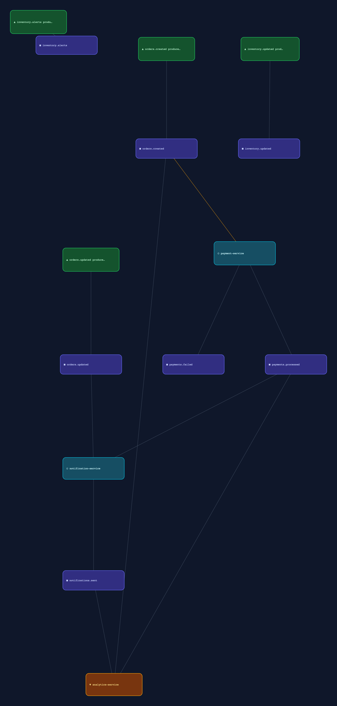

# Kafka Debug Flow

A real-time Kafka pipeline visualizer and full-featured management UI. See your entire event-driven architecture as a live, interactive graph — topics, services, consumer groups, and the data flowing between them. Manage topics, consumer groups, schemas, connectors, ACLs, quotas, and more — all from a single pane of glass.

[](https://github.com/tkollmer/KafkaGraphUI/actions/workflows/ci.yml)
[](LICENSE)
[](https://github.com/tkollmer/KafkaGraphUI/pkgs/container/kafkagraphui)



## Features

### Live Pipeline Graph
- Real-time visualization of topics, services, consumer groups, and producers
- Auto-detected service topology — services that both consume and produce are shown as pipeline nodes
- Click any node to highlight the full upstream/downstream data flow path
- Animated edges showing active message flow with lag indicators
- Click edges to inspect messages flowing through a topic
- Dagre-based auto-layout with manual re-layout support

### Dashboard
- Cluster health score with weighted deduction system (offline partitions, under-replicated, dead groups, etc.)
- Topic, consumer group, broker, and partition summary cards
- Under-replicated partition alerts
- Dead Letter Queue (DLQ) topic auto-detection with per-topic message counts
- Quick-action navigation to detailed views

### Topics Management
- List all topics with partition count, replication factor, message stats, and consumer group associations
- Advanced create dialog with cleanup policy, retention, min ISR settings
- Topic detail with 12 tabs:
  - **Partitions** — per-partition leader, replicas, ISR, offsets, leader skew detection
  - **Config** — inline editing with descriptions for all Kafka config keys
  - **Config Diff** — highlights non-default configuration values
  - **Messages** — live message browser with JSON formatting, filtering, auto-refresh
  - **Produce** — batch message producer with templates, headers, progress bar
  - **Search** — full-text search across message keys and values
  - **Replay** — replay messages from specific offsets or timestamps
  - **Consumers** — consumer groups consuming from this topic with lag details
  - **Reassign** — partition reassignment planner
  - **Key Analysis** — key cardinality analysis with top keys distribution
  - **Timeline** — real-time partition offset tracking with write rate charts and balance analysis
  - **Capacity** — storage projections, growth rate estimation, retention impact analysis, partition size distribution

### Consumer Groups
- List all groups with status, member count, total lag, sparkline lag history
- Lag alert rules with regex pattern matching and localStorage persistence
- Consumer group detail with 7 tabs:
  - **Members** — member assignments with member-to-topic ownership matrix
  - **Offsets** — per-partition offset and lag breakdown
  - **Lag** — real-time lag visualization
  - **Rebalances** — rebalance event timeline
  - **Timeline** — offset progression over time
  - **Partition Heatmap** — partition lag heatmap across members
  - **Lag Trend** — persistent lag trending with localStorage history, per-topic breakdowns, min/max/avg stats
- Reset offsets (latest, earliest, timestamp, specific offset)
- Delete consumer groups

### Brokers
- Cluster info with controller status
- Per-broker details: host, port, rack, leader partition count
- Log directory sizes and disk usage
- Rack-aware visualization
- Broker configuration viewer

### Schema Registry
- Subject listing with filtering
- Schema version browser with field table
- Schema diff viewer between versions
- Schema evolution lineage — field-level change tracking across versions (added/removed/modified)
- Register new schemas (Avro, JSON Schema, Protobuf)
- Compatibility testing
- Global and per-subject compatibility level display

### Kafka Connect
- Connector listing with status, type badges (source/sink), task health dots
- Connector detail with full config editor (inline editing, save, add/remove keys, secret masking)
- Health overview with status donut chart, task summary, type distribution
- Connector lifecycle: pause, resume, restart, delete
- Task restart support
- Plugin listing

### ACLs
- ACL listing with filtering by principal, resource, operation, permission
- Summary overview with permission donut chart
- Resource type and operation distribution badges
- Permission matrix — principal x resource grid with color-coded cells
- Principal, resource, and host counts

### Quotas
- Quota entry listing with entity type breakdown
- Summary cards with quota distribution bars
- Per-entry usage visualization relative to max values

### Settings
- Dark and bright theme toggle
- Graph configuration (show producers, sampling, lag threshold, animations)
- Connection status and cluster info

### Global Features
- Command palette (Cmd+K) — search across topics, consumer groups, brokers, pipeline nodes
- Sidebar favorites and recent items
- Auto-refresh with configurable intervals
- Freshness indicators showing data age
- Toast notifications for operations
- Responsive design with collapsible sidebar

## Quick Start

### Connect to your existing Kafka cluster

```yaml
# docker-compose.yml
services:
  kafka-debug-flow:
    image: ghcr.io/tkollmer/kafkagraphui:latest
    ports:
      - "8080:8080"
    environment:
      KAFKA_BOOTSTRAP_SERVERS: "your-broker:9092"
      SAMPLING_ENABLED: "true"
```

```bash
docker compose up -d
open http://localhost:8080
```

### Try the demo (includes Redpanda + example services)

```bash
git clone https://github.com/tkollmer/KafkaGraphUI.git
cd KafkaGraphUI
docker compose -f docker-compose.dev.yml up -d
open http://localhost:8899
```

The demo starts a Redpanda broker, 5 example microservices (order, payment, notification, analytics, inventory), and the UI.

## Kubernetes / Helm

Deploy to Kubernetes using the included Helm chart:

```bash
helm install kafka-debug-flow ./helm/kafka-debug-flow \
  --set env.KAFKA_BOOTSTRAP_SERVERS="my-kafka:9092"
```

With SASL authentication, create a secret first then reference it:

```bash
kubectl create secret generic kafka-credentials \
  --from-literal=KAFKA_SASL_USERNAME=admin \
  --from-literal=KAFKA_SASL_PASSWORD=secret \
  --from-literal=UI_USERNAME=admin \
  --from-literal=UI_PASSWORD=changeme

helm install kafka-debug-flow ./helm/kafka-debug-flow \
  --set env.KAFKA_BOOTSTRAP_SERVERS="my-kafka:9092" \
  --set existingSecret=kafka-credentials \
  --set ingress.enabled=true \
  --set ingress.hosts[0].host=kafka.example.com \
  --set ingress.hosts[0].paths[0].path=/ \
  --set ingress.hosts[0].paths[0].pathType=Prefix
```

See [`helm/kafka-debug-flow/values.yaml`](helm/kafka-debug-flow/values.yaml) for all configurable options.

## Configuration

All configuration via environment variables:

| Variable | Default | Description |
|---|---|---|
| `KAFKA_BOOTSTRAP_SERVERS` | `localhost:9092` | Kafka broker addresses |
| `POLL_INTERVAL_MS` | `2000` | How often to poll Kafka for updates |
| `SAMPLING_ENABLED` | `false` | Enable message sampling/inspection |
| `MAX_SAMPLE_MESSAGES` | `20` | Messages per sample request |
| `LAG_WARN_THRESHOLD` | `1000` | Lag threshold for visual warnings |
| `SHOW_PRODUCERS` | `false` | Show inferred producer nodes |
| `LOG_LEVEL` | `INFO` | Log level (DEBUG, INFO, WARNING, ERROR) |
| `SCHEMA_REGISTRY_URL` | | Schema Registry URL (optional) |
| `CONNECT_URL` | | Kafka Connect URL (optional) |

**SASL Authentication:**

| Variable | Default | Description |
|---|---|---|
| `KAFKA_SASL_ENABLED` | `false` | Enable SASL authentication |
| `KAFKA_SASL_USERNAME` | | SASL username |
| `KAFKA_SASL_PASSWORD` | | SASL password |
| `KAFKA_SSL_ENABLED` | `false` | Enable SSL/TLS |

## Architecture

```
┌─────────────────────────────────┐
│  React + ReactFlow + Tailwind   │  Frontend (SPA)
│  Zustand state, WebSocket sub   │
└──────────────┬──────────────────┘
               │ WS + REST
┌──────────────┴──────────────────┐
│  FastAPI + uvicorn              │  Backend
│  ├── WebSocket /ws/graph        │  Real-time graph diffs
│  ├── REST /api/*                │  Management operations
│  ├── KafkaCollector             │  Polls cluster metadata
│  ├── GraphStateBuilder          │  Computes topology diffs
│  ├── KafkaAdmin                 │  Admin operations
│  ├── MessageSampler             │  Message inspection
│  ├── SchemaRegistryClient       │  Schema Registry proxy
│  └── ConnectClient              │  Kafka Connect proxy
└──────────────┬──────────────────┘
               │ kafka-python-ng
┌──────────────┴──────────────────┐
│  Kafka / Redpanda / MSK / ...   │
└─────────────────────────────────┘
```

## Development

**Prerequisites:** Node.js 20+, Python 3.12+

```bash
# Backend
cd backend
pip install -r requirements.txt
KAFKA_BOOTSTRAP_SERVERS=localhost:9092 uvicorn main:app --reload --port 8080

# Frontend (separate terminal)
cd frontend
npm install
VITE_WS_URL=ws://localhost:8080 npm run dev
```

**Run tests:**

```bash
cd backend && python -m pytest tests/ -v
cd frontend && npx tsc --noEmit
```

**Build Docker image:**

```bash
docker build -t kafka-debug-flow .
```

## API Endpoints

| Method | Path | Description |
|---|---|---|
| GET | `/api/topics` | List all topics |
| GET | `/api/topics/{topic}` | Topic detail (config, partitions) |
| POST | `/api/topics` | Create topic |
| DELETE | `/api/topics/{topic}` | Delete topic |
| PUT | `/api/topics/{topic}/config` | Update topic config |
| POST | `/api/topics/{topic}/partitions` | Add partitions |
| GET | `/api/topics/{topic}/messages` | Sample messages |
| POST | `/api/topics/{topic}/produce` | Produce a message |
| GET | `/api/topics/{topic}/consumer-groups` | Topic's consumer groups |
| GET | `/api/consumer-groups` | List consumer groups |
| GET | `/api/consumer-groups/{group}` | Consumer group detail |
| POST | `/api/consumer-groups/{group}/reset-offsets` | Reset offsets |
| DELETE | `/api/consumer-groups/{group}` | Delete consumer group |
| GET | `/api/brokers` | List brokers |
| GET | `/api/brokers/{id}/config` | Broker configuration |
| GET | `/api/brokers/log-dirs` | Log directory sizes |
| GET | `/api/cluster` | Cluster info |
| GET | `/api/cluster/health` | Cluster health status |
| GET | `/api/schema-registry/subjects` | List schema subjects |
| GET | `/api/schema-registry/subjects/{subject}/versions` | Schema versions |
| POST | `/api/schema-registry/subjects/{subject}/versions` | Register schema |
| DELETE | `/api/schema-registry/subjects/{subject}` | Delete subject |
| GET | `/api/connect/connectors` | List connectors |
| GET | `/api/connect/connectors/{name}` | Connector detail |
| PUT | `/api/connect/connectors/{name}/config` | Update connector config |
| POST | `/api/connect/connectors/{name}/pause` | Pause connector |
| POST | `/api/connect/connectors/{name}/resume` | Resume connector |
| POST | `/api/connect/connectors/{name}/restart` | Restart connector |
| DELETE | `/api/connect/connectors/{name}` | Delete connector |
| GET | `/api/acls` | List ACLs |
| GET | `/api/quotas` | List quotas |
| GET | `/api/graph/snapshot` | Current graph state |
| GET | `/api/health` | Health check |
| GET | `/metrics` | Prometheus metrics |

## Tech Stack

- **Frontend:** React 19, ReactFlow (@xyflow/react 12), Tailwind CSS 4, Zustand 5, Dagre, TypeScript, Vite 7
- **Backend:** Python 3.12, FastAPI, kafka-python-ng, uvicorn, requests
- **Packaging:** Multi-stage Docker build, single container
- **Testing:** pytest (652+ backend tests), TypeScript strict mode
- **CI/CD:** GitHub Actions (CI + Release), Helm chart

## Contributing

See [CONTRIBUTING.md](CONTRIBUTING.md) for development setup and guidelines.

## License

MIT
